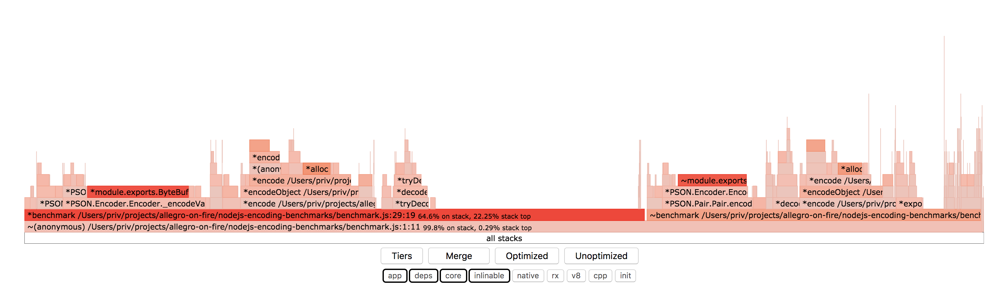
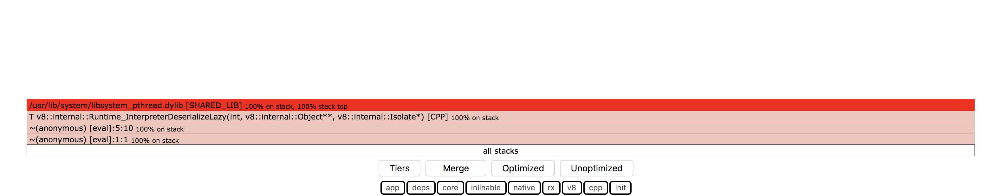

# Profiling using --prof inside worker_threads does not work

Generating flamegraphs with worker_thread produces isolate files that do not contain useful information.

Based on https://github.com/mattheworiordan/nodejs-encoding-benchmarks

# Running

```bash
npm install
```

You need `0x` to generate flamegraphs:

```bash
npm i -g 0x
```

Run using experimental workers:

```bash
node --prof --experimental-worker index.js
```

This will produce two isolate files, one for the main thread and one for the worker thread.

You have to move it to some subfolder,
because `0x` does some weird clean up after processing a file and will remove the other file.
Also `0x` accepts files in format `isolate-0xNNNNNNNNN-PPPP-v8.log` (where P is pid).

*Values between `isolate-0x` and `-v8.log` will be different every time you run it.*

```bash
mv isolate-0x105803c00-v8.log /tmp/isolate-0x102803600-0000-v8.log
cd /tmp
0x --visualize-only .
cp flamegraph.html ~/some-folder/thread-1.html
cd ~/some-folder/
mv isolate-0x104800000-v8.log /tmp/isolate-0x102803600-0000-v8.log
cd /tmp
0x --visualize-only .
cp flamegraph.html ~/some-folder/thread-2.html
```

Run using single threaded version:
```
node --prof --experimental-worker benchmark.js
mv isolate-0x104800000-v8.log isolate-0x104800000-1111-v8.log
cd 1231.0x
0x --visualize-only .
```

You should see something similar to this for single threaded version:


[single-threaded-node-js-flamegraph](flamegraphs/single-threaded.html)

And this for worker_threads:


[multi-threaded-node-js-flamegraph-thread-1](flamegraphs/thread-1.html)


[multi-threaded-node-js-flamegraph-thread-2](flamegraphs/thread-2.html)

### Side note:

What makes me think that this is a bug inside node not `0x` is that isolate files and
processed files (generated by running `node --prof-process`)
contain pretty much the same info that is on the flame graphs.
I used flamegraphs because they are easier for me to read.
